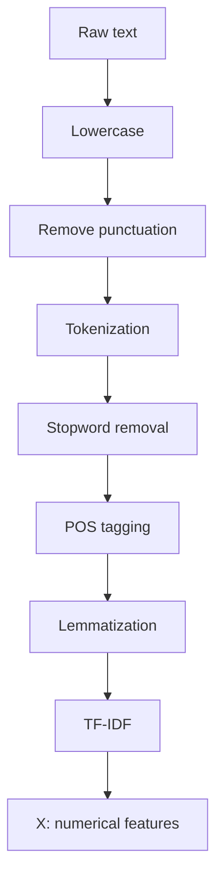

# 🤖 AI & Machine Learning — Learning

An evolving collection of hands-on work as I learn **AI and machine learning**.  
This project currently focuses on turning raw text into features that a machine-learning model can use.

---

## 📝 NLP pipeline

The text-processing workflow takes raw text through a series of cleaning and feature-extraction steps:



**Output:** `X`, a numerical feature matrix created with TF-IDF.

---

## 🚀 Next steps

Use the feature matrix `X` together with target labels `y` to train and evaluate a model:

1. **Prepare the data:** pair `X` with `y`.
2. **Train a model:** fit a machine-learning model to the data.
3. **Generate predictions:** predict labels for the examples.
4. **Evaluate performance:** calculate the F1-score and inspect the confusion matrix.

```text
X + y → Train model → Predictions → F1-score + Confusion matrix
```
